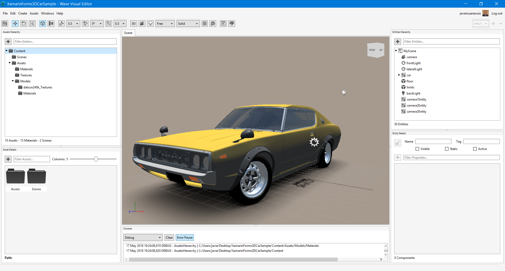

# Xamarin.Forms ARCore Sample using Wave Engine

Xamarin.Forms  application that makes use Wave Engine, cross platform game engine, to demonstrate the possibilities of mix Augmented Reality content with nice XAML UIs.

More information: [https://blog.xamarin.com/augmented-reality-xamarin-android-arcore](https://blog.xamarin.com/augmented-reality-xamarin-android-arcore)/

## Screens

 

## Requirements

* [Visual Studio __2015__](https://www.visualstudio.com/en-us/products/vs-2015-product-editions.aspx) Update 3 (14.0 or higher) to compile C# 6 language features (or Visual Studio MacOS)
* Xamarin add-ons for Visual Studio 3.2.1.64 or higher (available via the Visual Studio installer)
* [Wave Engine Editor](https://waveengine.net/Downloads)
* Wave Engine Nightly NuGet [feed](https://www.myget.org/F/waveengine-nightly/api/v3/index.json)

## Licenses

This project uses some third-party assets with a license that requires attribution:

- karolmiklas: 3D model creator in [Sketchfab](https://sketchfab.com/karolmiklas).

## Copyright and license

Code released under the [MIT license](https://opensource.org/licenses/MIT).